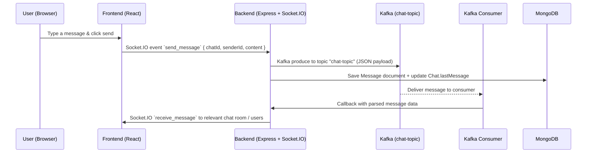

## Social Media Web App (Full‑Stack)

Full‑stack social media application with a **React (Vite) frontend** and a **Node.js (Express) backend**. It implements a mini social network with **auth**, **posts/status**, **profiles & following**, and a **real‑time chat system** powered by **Socket.IO + Kafka + MongoDB**. This README explains not only how to run the code, but also how the pieces work together.

---

### High‑level system overview

- **Frontend (SPA)**: Vite + React app that handles routing, UI, state management, and live updates from Socket.IO.
- **Backend (API + Real‑time)**: Express server exposing REST endpoints and a `/graphql` endpoint via Apollo Server. Same HTTP server also hosts Socket.IO for real‑time events.
- **Data layer**: MongoDB (via Mongoose) for users, posts/status, chats, and messages; Redis for caching/session‑like functionality.
- **Messaging layer**: Kafka (via KafkaJS) to decouple chat message ingestion from fan‑out/broadcast to connected clients.
- **DevOps**: Docker Compose runs ZooKeeper + Kafka; Jenkins pipeline installs deps, runs lint/tests, audits security, and builds images.

#### Architecture visualization

```mermaid
flowchart LR
  UserBrowser["User Browser\n(React + Vite)"]
  Frontend["Frontend\nReact SPA"]
  Backend["Backend\nExpress + Apollo + Socket.IO"]
  Mongo["MongoDB\n(Mongoose models)"]
  Redis["Redis\n(cache/session-like)"]
  Kafka["Kafka\n(chat-topic)"]
  Consumer["Kafka Consumer\n(in backend)"]

  UserBrowser --> Frontend
  Frontend -->|REST / GraphQL| Backend
  Frontend -->|WebSocket (Socket.IO)| Backend
  Backend -->|WebSocket (Socket.IO)| Frontend

  Backend --> Mongo
  Backend --> Redis

  Backend -->|produce chat message| Kafka
  Kafka --> Consumer
  Consumer -->|emit events| Backend
  Backend -->|broadcast| Frontend
```

---

## Tech stack

- **Frontend**
  - React + Vite
  - React Router (`Routes`, `Route`)
  - Redux Toolkit + React‑Redux
  - Chakra UI + Tailwind CSS
  - Socket.IO Client (`socket.io-client`)
  - Apollo Client (room to expand GraphQL usage)
- **Backend**
  - Node.js + Express
  - Apollo Server (`@apollo/server`) + `@as-integrations/express5` for `/graphql`
  - Socket.IO for real‑time communication
  - KafkaJS for producing/consuming chat events
  - MongoDB + Mongoose
  - Redis client
  - Multer for file uploads
  - JWT, `express-session`, `cookie-parser` for auth/session
- **Infra / DevOps**
  - Docker Compose for ZooKeeper + Kafka (`docker-compose.yml`)
  - Jenkins pipeline (`Jenkinsfile`)
  - Separate Dockerfiles for frontend and backend

---

## Project structure

```text
.
├─ backend/                       # Express + Apollo + Socket.IO + Kafka
│  ├─ config/
│  │  ├─ db.js                    # MongoDB connection (dev + test DB)
│  │  ├─ redis.js                 # Redis client
│  │  └─ socker.js                # Socket.IO server init + getIO()
│  ├─ controller/
│  │  ├─ login.js                 # Login / register logic
│  │  ├─ Status.js                # Status/profile endpoints
│  │  ├─ Save.js                  # Posts
│  │  ├─ search.js                # User search + follow
│  │  ├─ jwt.js                   # JWT verification middleware
│  │  └─ chat.js                  # Chat DB helper (message persistence)
│  ├─ model/
│  │  ├─ usersigma.js             # User schema
│  │  ├─ Status.js                # Status schema
│  │  ├─ post.js                  # Post schema
│  │  ├─ chat.js                  # Chat schema
│  │  ├─ message.js               # Message schema
│  │  └─ graphsql.js              # GraphQL typeDefs + resolvers
│  ├─ uploads/                    # Uploaded images (Multer)
│  ├─ tests/                      # Jest tests + Kafka mocks
│  ├─ node.js                     # Main server (Express + Apollo + Kafka + Socket.IO)
│  ├─ .env                        # Backend env vars (do NOT commit real secrets)
│  ├─ Dockerfile
│  └─ package.json
│
├─ frontend/                      # React (Vite) SPA
│  ├─ src/
│  │  ├─ App.jsx                  # Routes definition
│  │  ├─ main.jsx                 # App bootstrap + BrowserRouter
│  │  ├─ Home.jsx / Homepage.jsx  # Home feeds
│  │  ├─ Authentication.jsx       # Login / signup wrapper
│  │  ├─ Signup.jsx               # Registration page
│  │  ├─ Dashboard.jsx            # Main dashboard
│  │  ├─ components/              # UI pieces (Navbar, Post, Chatlist, etc.)
│  │  ├─ context/                 # Global state + Socket context
│  │  └─ lib/socket.js            # Socket.IO client helper
│  ├─ Dockerfile
│  ├─ jest.config.js
│  ├─ vite.config.js
│  └─ package.json
│
├─ docker-compose.yml             # ZooKeeper + Kafka
├─ Dockerfile-compose.yml         # Utility container (not core app)
└─ Jenkinsfile                    # CI pipeline
```

---

## Detailed feature overview

### 1. Authentication & sessions

- **Register (`POST /api/register`)**
  - Creates a new user document in MongoDB (username, email, password).
  - Basic duplicate check on email to prevent re‑registration.
- **Login (`POST /api/login`)**
  - Verifies credentials with bcrypt.
  - Signs a JWT containing user id, username, and email.
  - Sets the JWT into an **HTTP‑only cookie** (`sociluser`) with a 7‑day expiry.
  - Optionally stores a session representation via a `setsession` helper.
- **Session / JWT verification**
  - `express-session` + `cookie-parser` are enabled.
  - A JWT middleware exposes an `/api/verify` route to check current user identity.

### 2. Status, posts & profile

- **Status**
  - Users can create status entries with optional images using Multer (`/api/addstatus`).
  - Status can be fetched (e.g. `/api/getstatus`, `/api/getprofile`) for feeds or profile views.
- **Posts**
  - Similar to status but oriented to posts/feeds (`/api/poststatus`, `/api/getpost`).
  - GraphQL schema (`graphsql.js`) exposes `getstatus(id)` and mutations for comments/likes.
- **Profile & following**
  - Search users (`/api/search`), follow users (`/api/following`), and fetch user lists (`/api/getuser`).

### 3. Real‑time chat with Kafka & Socket.IO

**Key concepts**

- Each chat is represented by a `Chat` document, with `participants` as an array of user IDs.
- Each message is stored as a `Message` document with `chatId`, `sender`, `content`, `timestamp`.
- Socket.IO is attached to the HTTP server; clients connect using the same host/port as the backend.
- Kafka is used as a **message bus** for chat messages (`chat-topic`).

#### Chat flow visualization



**Implementation notes (from `backend/node.js`):**

- `initSocket(server)` initializes Socket.IO with CORS origin `http://localhost:5173`.
- `io.on('connection', ...)` manages:
  - `user_join` → marks user online, joins all their chat rooms, broadcasts online status.
  - `join_chat` → joins a specific chat room.
  - `send_message` → validates payload, saves to MongoDB, produces to Kafka, updates chat metadata, and emits updates to participants.
  - `typing_start` / `typing_stop` → broadcasts typing indicators to a specific chat room.
  - `disconnect` → marks user offline and broadcasts offline status.

### 4. GraphQL (Apollo Server)

- Apollo Server is created in `backend/node.js` with `typeDefs` and `resolvers` from `model/graphsql.js`.
- It is mounted as Express middleware on `/graphql` inside `startApolloServer()`.
- The schema currently supports:
  - `Query.hello` → simple health check: `"graphql is work correctly"`.
  - `Query.getstatus(id: ID!)` → returns a single status document.
  - Mutations to add comments and likes to posts (`Postcomment`, `PushLike`).

You can explore the schema using any GraphQL client (e.g. Insomnia, Postman, Apollo Studio) pointing to **`http://localhost:3003/graphql`**.

---

## Frontend application flow

### Routing & layout

- `main.jsx` wraps the app with `BrowserRouter` and renders `App.jsx`.
- `App.jsx` defines `Routes` such as:
  - `/` → `Home` / `Homepage`
  - `/login` / `/signup` → `Authentication` + `Signup`
  - `/dashboard` → `Dashboard`
  - `/profile` → `Profile` / `ProfilePage`
  - Chat‑related routes (e.g. dashboard tabs/components for chat UI)

### State & context

- `context/store.js` and `context.js` manage global UI/app state using Redux Toolkit and/or React context.
- `context/socketcontext.jsx` provides a Socket.IO client instance to components.
- `src/lib/socket.js` centralizes connection logic to the backend’s Socket.IO server.

### Main UI components (examples)

- `Navbar.jsx` – top navigation bar, links to main sections.
- `Post.jsx`, `Postshow.jsx`, `showpost.jsx`, `AddPost.jsx` – create and display posts.
- `StatuV1.jsx`, `Staturing.jsx`, `Addstatus.jsx` – status creation and display.
- `Chatlist.jsx`, `Chatbot.jsx`, `Socket.jsx` – chat listing, chat window, and socket wiring.
- `Profile.jsx`, `ProfilePage.jsx` – user profile view and edit.
- `Search.jsx` – search users and follow.

The frontend consumes:

- REST APIs for auth, profile, status, and posts.
- Socket.IO for chat events, online/offline presence, and typing indicators.
- (Optional) GraphQL for status/post queries and mutations.

---

## API surface (high level)

- **REST (Express)** (all relative to `http://localhost:3003`):
  - `POST /api/register` – register a user.
  - `POST /api/login` – authenticate and set JWT cookie.
  - `GET /api/verify` – verify JWT and return current user info.
  - `POST /api/addstatus` – create a status (multipart/form‑data with `image`).
  - `POST /api/poststatus` – create a post (multipart/form‑data).
  - `GET /api/getstatus`, `GET /api/getpost`, `GET /api/getprofile` – fetch status/posts/profile.
  - `POST /api/search` – search user by name/email.
  - `POST /api/following` – follow user.
  - `GET /api/getuser` – list users.
  - `GET /api/chats/:userId` – list a user’s chats.
  - `POST /api/chats` – create/find a chat for participants.
  - `GET /api/messages` / `GET /api/messages/:chatId` – fetch messages.
- **GraphQL (Apollo)**
  - Endpoint: `POST http://localhost:3003/graphql`
  - Example query:

    ```graphql
    query {
      hello
    }
    ```

- **Static uploads**
  - `GET /uploads/*` – serves uploaded images.
- **Socket.IO**
  - Same host/port as backend: `io("http://localhost:3003", { withCredentials: true })`.

---

## Prerequisites

- Node.js (LTS recommended)
- MongoDB running locally on `mongodb://localhost:27017`
- Redis running on `localhost:6379` (DB index 4 in current config)
- Docker (for Kafka/ZooKeeper via Docker Compose)

---

## Local setup (development)

### 1) Start Kafka (recommended for full chat flow)

From the repo root:

```bash
docker compose up -d
```

This starts:

- ZooKeeper (client port `2181`)
- Kafka broker exposed on **`localhost:9092`**

### 2) Backend

```bash
cd backend
npm install
node node.js
```

- Backend runs on **`http://localhost:3003`**.
- On start, it will:
  - Connect to MongoDB (`myuserdb` by default, `social_media_test` in test mode).
  - Connect to Redis.
  - Start Apollo Server and mount `/graphql`.
  - Initialize Socket.IO.
  - Connect to Kafka, initialize producer + consumer, and subscribe to `chat-topic`.

### 3) Frontend

```bash
cd frontend
npm install
npm run dev
```

- Frontend runs on **`http://localhost:5173`** by default.
- CORS on the backend is configured to allow this origin with credentials.

---

## Environment variables / configuration

Backend loads environment variables from **`backend/.env`** via `dotenv`.

Consider using a template like `backend/.env.example`:

```env
MONGO_URI=mongodb://localhost:27017/myuserdb
REDIS_HOST=localhost
REDIS_PORT=6379
REDIS_DB=4
KAFKA_BROKER=localhost:9092
JWT_SECRET=change-me
SESSION_SECRET=change-me-too
GITHUB_CLIENT_ID=your-client-id
GITHUB_CLIENT_SECRET=your-client-secret
EMAIL_FROM=your-email@example.com
```

- **Important**: Do **not** store real secrets (like actual OAuth client secrets or personal email passwords) in Git. Commit only placeholder/example values.
- **Kafka**: current code uses broker `localhost:9092` (must match Docker Compose config).
- **CORS**: backend allows origin `http://localhost:5173` with `credentials: true`.

---

## CI pipeline (Jenkins)

The `Jenkinsfile` defines a multi‑stage pipeline:

1. **Checkout SCM** – pulls this repository.
2. **Install Dependencies** – runs `npm ci` in `frontend` and `backend` in parallel.
3. **Lint Code**
   - Frontend: `npm run lint` in `frontend`.
   - Backend: placeholder step (can be expanded with ESLint for backend).
4. **Run Tests**
   - Frontend: `npm run test` (Jest + React Testing Library).
   - Backend: `npm run test` (Jest + Supertest; Kafka is mocked in tests).
5. **Security Audit**
   - `npm audit --audit-level moderate` for both frontend and backend.
6. **Build Images**
   - `docker build -t social-media-frontend .` (in `frontend`).
   - `docker build -t social-media-backend .` (in `backend`). 
7. **Post actions**
   - Archive JUnit XML (`**/junit.xml`) and coverage reports.
   - Run `docker system prune -f` to clean up.

---

## Running tests

### Backend

```bash
cd backend
npm test
```

- Uses Jest with a dedicated test database (`social_media_test`) and mocked Kafka/Redis.

### Frontend

```bash
cd frontend
npm test
```

- Uses Jest + React Testing Library (`@testing-library/react`, `@testing-library/jest-dom`).

---

## Future improvements / notes

- Move all hard‑coded secrets into environment variables and provide a clean `.env.example` only.
- Add stronger validation and error handling across controllers (especially auth & file uploads).
- Harden security: rate limiting, helmet, CSRF protection (if needed), password policies.
- Extend GraphQL schema to cover more of the REST functionality (posts, chats, profiles).
- Add more end‑to‑end tests (including UI + API + WebSocket flows).

# Social Media Web App (Full‑Stack)

Full‑stack social media application with a **React (Vite) frontend** and a **Node.js (Express) backend**. The backend provides **REST APIs**, a **GraphQL endpoint (Apollo Server)**, **real‑time chat with Socket.IO**, and **Kafka** for message fan‑out. MongoDB stores application data; Redis is used for caching/session-like utilities.

## Tech stack

- **Frontend**: React + Vite, React Router, Redux Toolkit, Chakra UI, Tailwind CSS, Socket.IO Client, Apollo Client
- **Backend**: Node.js, Express, Apollo Server (GraphQL), Socket.IO, KafkaJS, Mongoose (MongoDB), Redis, Multer (uploads), JWT + cookies + sessions
- **Infra/DevOps**: Docker Compose (Kafka + ZooKeeper), Jenkins pipeline (`Jenkinsfile`)

## Project structure

```
.
├─ backend/                 # Express + Apollo + Socket.IO + Kafka
├─ frontend/                # React (Vite) client
├─ docker-compose.yml       # ZooKeeper + Kafka (Confluent images)
└─ Jenkinsfile              # CI: install, lint, test, build images
```

## What’s implemented (project analysis)

- **Authentication**
  - Register/login with **JWT stored in an HTTP-only cookie**
  - Session middleware enabled for server-side session support
- **Posts / Status**
  - Create status/post with optional image upload (Multer)
  - Fetch statuses/posts for feeds and profiles
- **Profile / Social graph**
  - Search users, follow users, fetch profile info
- **Real-time chat**
  - Socket.IO rooms per chat, typing indicators, online/offline presence
  - Messages are **produced to Kafka** and **consumed back** to broadcast to clients
- **GraphQL**
  - Apollo Server mounted at **`/graphql`**
  - Example query: `hello` returns `"graphql is work correctly"`

## API surface (high level)

- **REST (Express)**: mounted under **`/api/*`** (login/register, status, post, search, follow, chat, messages)
- **GraphQL (Apollo)**: **`http://localhost:3003/graphql`**
- **Uploads**: static served from **`/uploads`** (backed by `backend/uploads/`)
- **Socket.IO**: attached to the backend HTTP server (same host/port as backend)

## Prerequisites

- Node.js (LTS recommended)
- MongoDB running locally on `mongodb://localhost:27017`
- Redis running locally on `localhost:6379`
- Docker (optional, for Kafka/ZooKeeper)

## Local setup (development)

### 1) Start Kafka (optional but recommended for chat fan-out)

From the repo root:

```bash
docker compose up -d
```

Kafka is exposed on **`localhost:9092`**.

### 2) Backend

```bash
cd backend
npm install
node node.js
```

Backend runs on **`http://localhost:3003`**.

### 3) Frontend

```bash
cd frontend
npm install
npm run dev
```

Frontend runs on **`http://localhost:5173`**.

## Environment variables / configuration

Backend loads environment variables from **`backend/.env`** via `dotenv`.

- **Important**: Do **not** commit real secrets (OAuth client secrets, emails, API keys). Prefer a `backend/.env.example` template with placeholder values.
- **Kafka**: current config in code uses broker `localhost:9092` (ensure Kafka is running there).
- **CORS**: backend allows origin `http://localhost:5173` with credentials enabled.

## CI (Jenkins)

The `Jenkinsfile` runs:

- Install dependencies (frontend + backend)
- Lint (frontend)
- Tests (frontend + backend)
- Security audit (npm audit)
- Build Docker images (`social-media-frontend`, `social-media-backend`)

## Running tests

```bash
cd backend
npm test
```

```bash
cd frontend
npm test
```

## Notes / known gaps

- Some production hardening is still needed (moving hard-coded secrets to env vars, adding rate limiting, stronger validation, and a documented `.env.example`).

