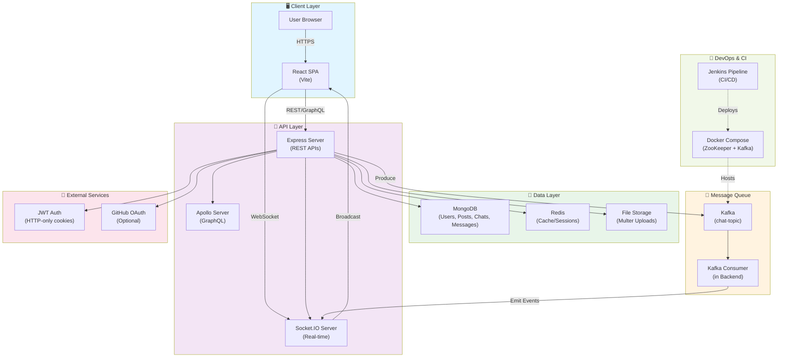
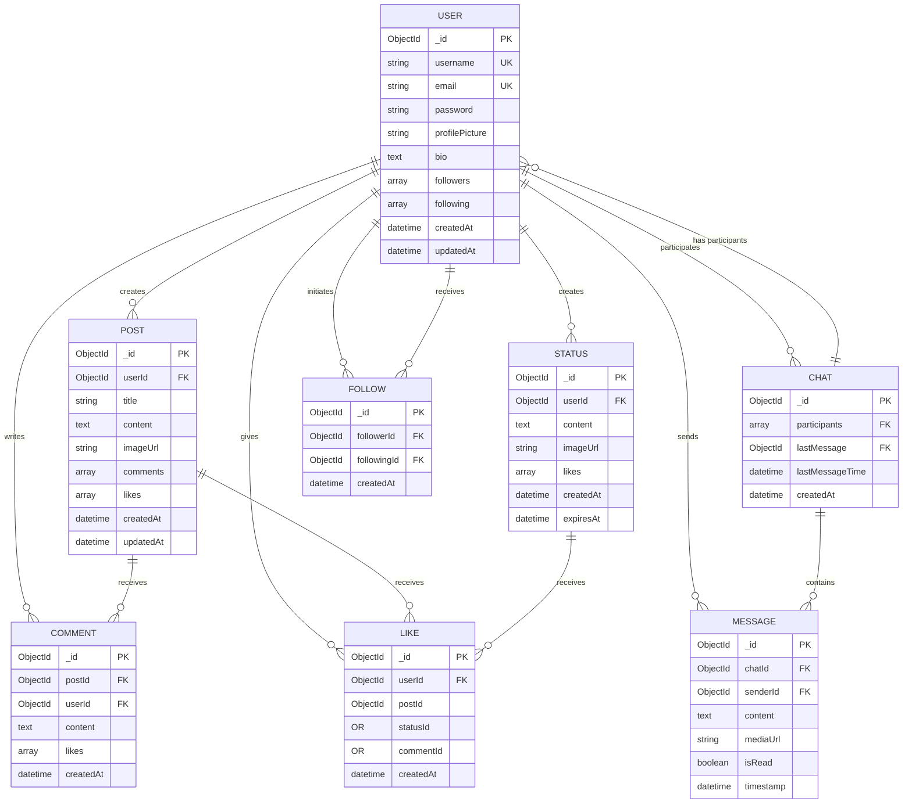
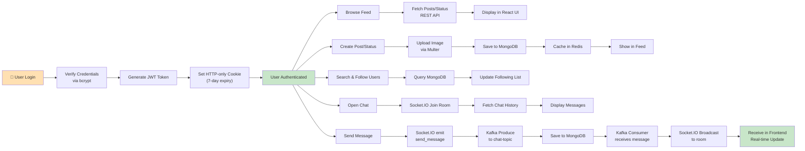
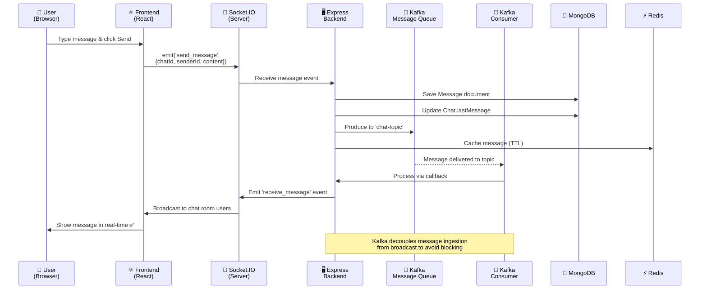
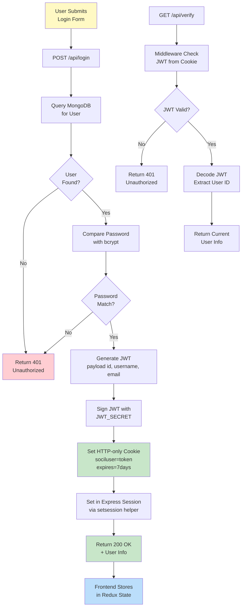
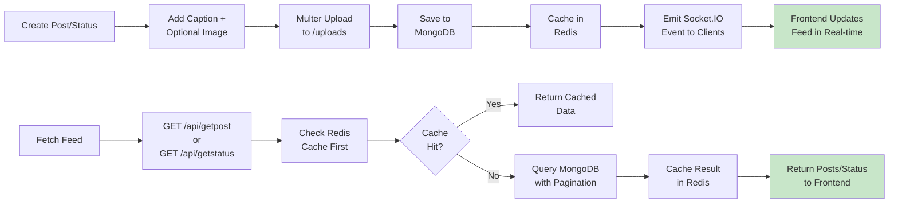
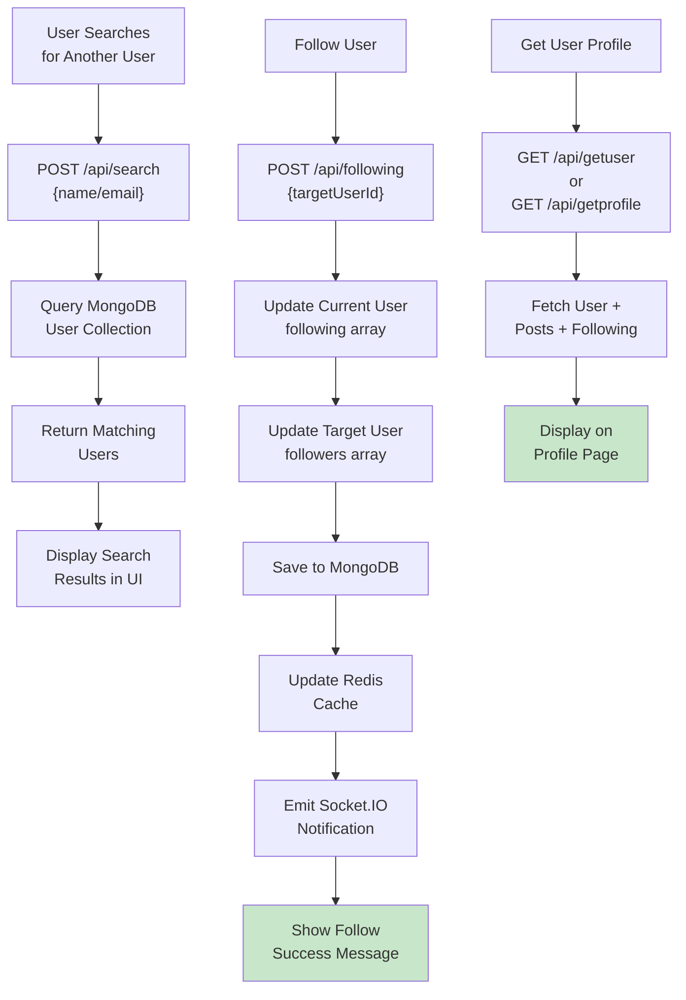
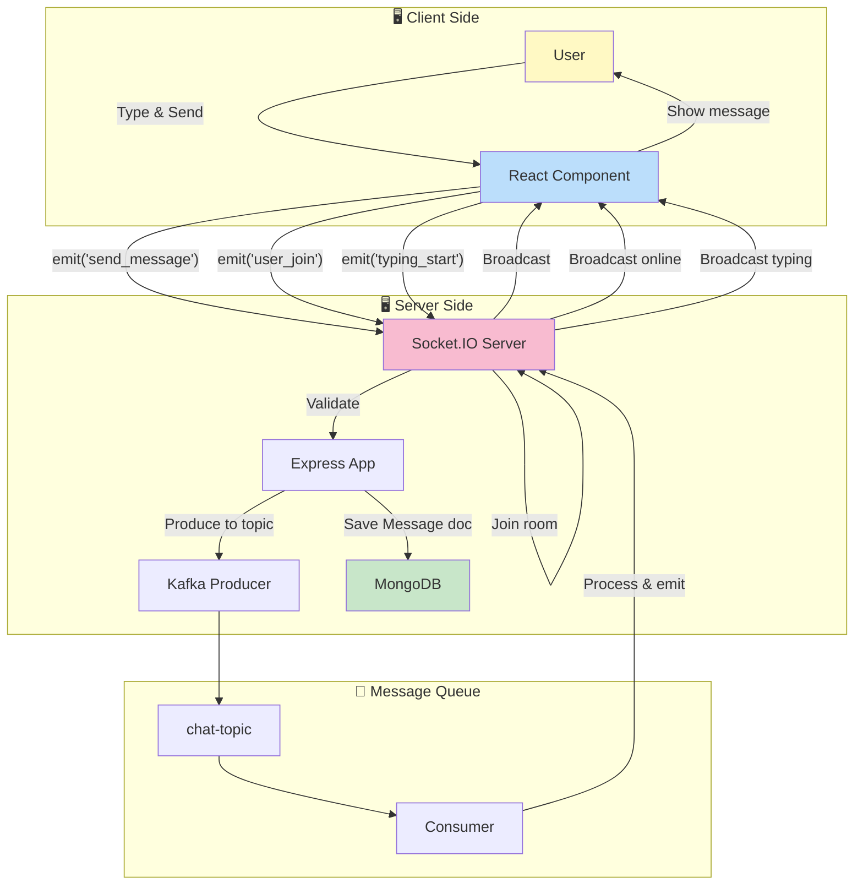

# Social Media Web App (Full‑Stack)

Full‑stack social media application with a **React (Vite) frontend** and a **Node.js (Express) backend**. It implements a mini social network with **auth**, **posts/status**, **profiles & following**, and **real‑time chat** using modern web technologies.

**Language Composition:** JavaScript 98.2% | Other 1.8%

---

## 📊 Complete System Architecture

### High-Level System Overview


```mermaid
graph TB
    subgraph Client["🖥️ Client Layer"]
        Browser["User Browser"]
        React["React SPA<br/>(Vite)"]
    end

    subgraph API["🔌 API Layer"]
        Express["Express Server<br/>(REST APIs)"]
        Apollo["Apollo Server<br/>(GraphQL)"]
        Socket["Socket.IO Server<br/>(Real-time)"]
    end

    subgraph Data["💾 Data Layer"]
        MongoDB["MongoDB<br/>(Users, Posts, Chats, Messages)"]
        Redis["Redis<br/>(Cache/Sessions)"]
        FileUpload["File Storage<br/>(Multer Uploads)"]
    end

    subgraph MessageQueue["📨 Message Queue"]
        Kafka["Kafka<br/>(chat-topic)"]
        Consumer["Kafka Consumer<br/>(in Backend)"]
    end

    subgraph External["🔐 External Services"]
        JWT["JWT Auth<br/>(HTTP-only cookies)"]
        Github["GitHub OAuth<br/>(Optional)"]
    end

    subgraph DevOps["🐳 DevOps & CI"]
        Docker["Docker Compose<br/>(ZooKeeper + Kafka)"]
        Jenkins["Jenkins Pipeline<br/>(CI/CD)"]
    end

    Browser -->|HTTPS| React
    React -->|REST/GraphQL| Express
    React -->|WebSocket| Socket
    Express --> Apollo
    Express --> Socket
    Express --> MongoDB
    Express --> Redis
    Express --> FileUpload
    Express -->|Produce| Kafka
    Kafka --> Consumer
    Consumer -->|Emit Events| Socket
    Socket -->|Broadcast| React
    Express --> JWT
    Express --> Github
    Docker -.->|Hosts| Kafka
    Jenkins -.->|Deploys| Docker

    style Client fill:#e1f5ff
    style API fill:#f3e5f5
    style Data fill:#e8f5e9
    style MessageQueue fill:#fff3e0
    style External fill:#fce4ec
    style DevOps fill:#f1f8e9
```

---

## 📐 Complete Entity-Relationship Diagram (ER Diagram)

### Database Schema Design


```mermaid
erDiagram
    USER ||--o{ POST : creates
    USER ||--o{ STATUS : creates
    USER ||--o{ CHAT : participates
    USER ||--o{ MESSAGE : sends
    USER ||--o{ COMMENT : writes
    USER ||--o{ LIKE : gives
    USER ||--o{ FOLLOW : initiates
    USER ||--o{ FOLLOW : receives

    CHAT ||--o{ MESSAGE : contains
    CHAT ||--o{ USER : "has participants"

    POST ||--o{ COMMENT : receives
    POST ||--o{ LIKE : receives

    STATUS ||--o{ LIKE : receives

    USER {
        ObjectId _id PK
        string username UK
        string email UK
        string password
        string profilePicture
        text bio
        array followers
        array following
        datetime createdAt
        datetime updatedAt
    }

    POST {
        ObjectId _id PK
        ObjectId userId FK
        string title
        text content
        string imageUrl
        array comments
        array likes
        datetime createdAt
        datetime updatedAt
    }

    STATUS {
        ObjectId _id PK
        ObjectId userId FK
        text content
        string imageUrl
        array likes
        datetime createdAt
        datetime expiresAt
    }

    CHAT {
        ObjectId _id PK
        array participants FK
        ObjectId lastMessage FK
        datetime lastMessageTime
        datetime createdAt
    }

    MESSAGE {
        ObjectId _id PK
        ObjectId chatId FK
        ObjectId senderId FK
        text content
        string mediaUrl
        boolean isRead
        datetime timestamp
    }

    COMMENT {
        ObjectId _id PK
        ObjectId postId FK
        ObjectId userId FK
        text content
        array likes
        datetime createdAt
    }

    LIKE {
        ObjectId _id PK
        ObjectId userId FK
        ObjectId postId OR statusId OR commentId
        datetime createdAt
    }

    FOLLOW {
        ObjectId _id PK
        ObjectId followerId FK
        ObjectId followingId FK
        datetime createdAt
    }
```

---

## 🏗️ Complete Application Architecture Flow

### User Interaction Flow


```mermaid
graph LR
    A["🔐 User Login"] --> B["Verify Credentials<br/>via bcrypt"]
    B --> C["Generate JWT Token"]
    C --> D["Set HTTP-only Cookie<br/>(7-day expiry)"]
    D --> E["User Authenticated"]

    E --> F["Browse Feed"]
    F --> G["Fetch Posts/Status<br/>REST API"]
    G --> H["Display in React UI"]

    E --> I["Create Post/Status"]
    I --> J["Upload Image<br/>via Multer"]
    J --> K["Save to MongoDB"]
    K --> L["Cache in Redis"]
    L --> M["Show in Feed"]

    E --> N["Search & Follow Users"]
    N --> O["Query MongoDB"]
    O --> P["Update Following List"]

    E --> Q["Open Chat"]
    Q --> R["Socket.IO Join Room"]
    R --> S["Fetch Chat History"]
    S --> T["Display Messages"]

    E --> U["Send Message"]
    U --> V["Socket.IO emit<br/>send_message"]
    V --> W["Kafka Produce<br/>to chat-topic"]
    W --> X["Save to MongoDB"]
    X --> Y["Kafka Consumer<br/>receives message"]
    Y --> Z["Socket.IO Broadcast<br/>to room"]
    Z --> AA["Receive in Frontend<br/>Real-time Update"]

    style A fill:#ffe0b2
    style E fill:#c8e6c9
    style AA fill:#c8e6c9
```

### Chat Message Flow (Detailed)


```mermaid
sequenceDiagram
    participant User as 👤 User<br/>(Browser)
    participant FrontEnd as ⚛️ Frontend<br/>(React)
    participant Socket as 🔌 Socket.IO<br/>(Server)
    participant Backend as 🖥️ Express<br/>Backend
    participant Kafka as 📨 Kafka<br/>Message Queue
    participant Consumer as 🔄 Kafka<br/>Consumer
    participant MongoDB as 💾 MongoDB
    participant Redis as ⚡ Redis

    User->>FrontEnd: Type message & click Send
    FrontEnd->>Socket: emit('send_message',<br/>{chatId, senderId, content})
    Socket->>Backend: Receive message event
    Backend->>MongoDB: Save Message document
    Backend->>MongoDB: Update Chat.lastMessage
    Backend->>Kafka: Produce to 'chat-topic'
    Backend->>Redis: Cache message (TTL)
    Kafka-->>Consumer: Message delivered to topic
    Consumer->>Backend: Process via callback
    Backend->>Socket: Emit 'receive_message' event
    Socket->>FrontEnd: Broadcast to chat room users
    FrontEnd->>User: Show message in real-time ✅

    Note over Backend,Consumer: Kafka decouples message ingestion<br/>from broadcast to avoid blocking
```

---

## 🛠️ Tech Stack

### Frontend
- **React + Vite** – SPA framework with fast build tooling
- **React Router** – Client-side routing (`Routes`, `Route`)
- **Redux Toolkit + React‑Redux** – Global state management
- **Chakra UI + Tailwind CSS** – Modern UI component library + utility CSS
- **Socket.IO Client** – Real-time bidirectional communication
- **Apollo Client** – GraphQL client (expandable for future mutations)
- **Jest + React Testing Library** – Unit & component testing

### Backend
- **Node.js + Express** – Runtime & HTTP server framework
- **Apollo Server + @apollo/server** – GraphQL API with `/graphql` endpoint
- **Socket.IO** – Real-time WebSocket communication
- **KafkaJS** – Produce/consume chat events for async message handling
- **MongoDB + Mongoose** – Document-based data storage with schema validation
- **Redis** – In-memory cache & session-like storage
- **Multer** – File upload middleware
- **JWT + express-session + cookie-parser** – Authentication & session management
- **Bcrypt** – Password hashing
- **Jest + Supertest** – Backend testing with mocked Kafka/Redis

### Infrastructure & DevOps
- **Docker Compose** – Orchestration for ZooKeeper + Kafka
- **Jenkins** – CI/CD pipeline (lint, test, security audit, build images)
- **Separate Dockerfiles** – Frontend & backend containerization
- **GitHub OAuth** – Optional third-party authentication

---

## 📁 Project Structure

```
.
├─ backend/                          # Express + Apollo + Socket.IO + Kafka
│  ├─ config/
│  │  ├─ db.js                       # MongoDB connection (dev + test DB)
│  │  ├─ redis.js                    # Redis client initialization
│  │  └─ socket.js                   # Socket.IO server init + getIO()
│  │
│  ├─ controller/
│  │  ├─ login.js                    # Login / register logic (JWT + bcrypt)
│  │  ├─ Status.js                   # Status/profile REST endpoints
│  │  ├─ Save.js                     # Posts creation & retrieval
│  │  ├─ search.js                   # User search + follow functionality
│  │  ├─ jwt.js                      # JWT verification middleware
│  │  └─ chat.js                     # Chat DB helpers (persistence)
│  │
│  ├─ model/
│  │  ├─ usersigma.js                # User schema (username, email, etc.)
│  │  ├─ Status.js                   # Status schema (content + images)
│  │  ├─ post.js                     # Post schema (feed-oriented)
│  │  ├─ chat.js                     # Chat schema (participants array)
│  │  ├─ message.js                  # Message schema (content + metadata)
│  │  └─ graphsql.js                 # GraphQL typeDefs + resolvers
│  │
│  ├─ uploads/                       # Uploaded images (Multer destination)
│  ├─ tests/                         # Jest test suites + Kafka mocks
│  ├─ node.js                        # Main server entry (Express + Apollo + Kafka + Socket.IO)
│  ├─ .env                           # Backend env vars (NEVER commit real secrets)
│  ├─ .env.example                   # Template for env vars
│  ├─ Dockerfile                     # Build image for backend
│  └─ package.json                   # Dependencies & scripts
│
├─ frontend/                         # React (Vite) Single Page Application
│  ├─ src/
│  │  ├─ App.jsx                     # Routes definition (React Router)
│  │  ├─ main.jsx                    # App bootstrap + BrowserRouter wrapper
│  │  ├─ index.css                   # Global styles (Tailwind)
│  │  │
│  │  ├─ pages/
│  │  │  ├─ Home.jsx / Homepage.jsx  # Home feed (posts & statuses)
│  │  │  ���─ Authentication.jsx       # Auth wrapper for login/signup
│  │  │  ├─ Signup.jsx               # User registration page
│  │  │  ├─ Dashboard.jsx            # Main dashboard (posts, chat, profile)
│  │  │  ├─ Profile.jsx              # User profile view & edit
│  │  │  ├─ ProfilePage.jsx          # Public profile page
│  │  │  └─ [other pages]
│  │  │
│  │  ├─ components/
│  │  │  ├─ Navbar.jsx               # Top navigation bar
│  │  │  ├─ Post.jsx                 # Single post display
│  │  │  ├─ Postshow.jsx             # Post detail view
│  │  │  ├─ AddPost.jsx              # Post creation form
│  │  │  ├─ Status.jsx / StatuV1.jsx # Status display components
│  │  │  ├─ Addstatus.jsx            # Status creation
│  │  │  ├─ Chatlist.jsx             # List of chats
│  │  │  ├─ Chatbot.jsx              # Chat window interface
│  │  │  ├─ Socket.jsx               # Socket.IO event wiring
│  │  │  ├─ Search.jsx               # User search + follow UI
│  │  │  └─ [other UI components]
│  │  │
│  │  ├─ context/
│  │  │  ├─ store.js                 # Redux Toolkit store configuration
│  │  │  ├─ context.js               # Redux slices & actions
│  │  │  └─ socketcontext.jsx        # Socket.IO context provider
│  │  │
│  │  ├─ lib/
│  │  │  └─ socket.js                # Socket.IO client helper & connection logic
│  │  │
│  │  └─ services/
│  │     └─ [API helper functions]
│  │
│  ├─ public/                        # Static assets (favicon, etc.)
│  ├─ Dockerfile                     # Build image for frontend
│  ├─ jest.config.js                 # Jest configuration
│  ├─ vite.config.js                 # Vite build configuration
│  ├─ tailwind.config.js             # Tailwind CSS configuration
│  └─ package.json                   # Dependencies & scripts
│
├─ .github/
│  └─ workflows/                     # GitHub Actions (optional CI)
│
├─ docker-compose.yml                # Docker Compose for ZooKeeper + Kafka
├─ Dockerfile-compose.yml            # Utility container (development helper)
├─ Jenkinsfile                       # Jenkins CI/CD pipeline definition
└─ README.md                         # This file
```

---

## 🔑 Feature Overview

### 1. Authentication & Sessions


```mermaid
graph TD
    A["User Submits<br/>Login Form"] --> B["POST /api/login"]
    B --> C["Query MongoDB<br/>for User"]
    C --> D{"User<br/>Found?"}
    D -->|No| E["Return 401<br/>Unauthorized"]
    D -->|Yes| F["Compare Password<br/>with bcrypt"]
    F --> G{"Password<br/>Match?"}
    G -->|No| E
    G -->|Yes| H["Generate JWT<br/>payload id, username, email"]
    H --> I["Sign JWT with<br/>JWT_SECRET"]
    I --> J["Set HTTP-only Cookie<br/>sociluser=token<br/>expires=7days"]
    J --> K["Set in Express Session<br/>via setsession helper"]
    K --> L["Return 200 OK<br/>+ User Info"]
    L --> M["Frontend Stores<br/>in Redux State"]

    N["GET /api/verify"] --> O["Middleware Check<br/>JWT from Cookie"]
    O --> P{"JWT Valid?"}
    P -->|No| Q["Return 401<br/>Unauthorized"]
    P -->|Yes| R["Decode JWT<br/>Extract User ID"]
    R --> S["Return Current<br/>User Info"]

    style A fill:#fff9c4
    style J fill:#c8e6c9
    style L fill:#c8e6c9
    style E fill:#ffcdd2
    style M fill:#bbdefb
```

**Key Implementation Notes:**
- Uses **bcrypt** for secure password hashing (salted)
- JWT stored in **HTTP-only, Secure, SameSite** cookies (CSRF-resistant)
- 7-day expiration window for JWT tokens
- Express-session middleware for optional server-side sessions
- `/api/verify` endpoint for checking current user authentication status

---

### 2. Posts & Status Management


```mermaid
graph LR
    A["Create Post/Status"] --> B["Add Caption +<br/>Optional Image"]
    B --> C["Multer Upload<br/>to /uploads"]
    C --> D["Save to<br/>MongoDB"]
    D --> E["Cache in<br/>Redis"]
    E --> F["Emit Socket.IO<br/>Event to Clients"]
    F --> G["Frontend Updates<br/>Feed in Real-time"]

    H["Fetch Feed"] --> I["GET /api/getpost<br/>or<br/>GET /api/getstatus"]
    I --> J["Check Redis<br/>Cache First"]
    J --> K{"Cache<br/>Hit?"}
    K -->|Yes| L["Return Cached<br/>Data"]
    K -->|No| M["Query MongoDB<br/>with Pagination"]
    M --> N["Cache Result<br/>in Redis"]
    N --> O["Return Posts/Status<br/>to Frontend"]

    style G fill:#c8e6c9
    style O fill:#c8e6c9
```

---

### 3. Social Graph (Users & Following)


```mermaid
graph TB
    A["User Searches<br/>for Another User"] --> B["POST /api/search<br/>{name/email}"]
    B --> C["Query MongoDB<br/>User Collection"]
    C --> D["Return Matching<br/>Users"]
    D --> E["Display Search<br/>Results in UI"]

    F["Follow User"] --> G["POST /api/following<br/>{targetUserId}"]
    G --> H["Update Current User<br/>following array"]
    H --> I["Update Target User<br/>followers array"]
    I --> J["Save to MongoDB"]
    J --> K["Update Redis<br/>Cache"]
    K --> L["Emit Socket.IO<br/>Notification"]
    L --> M["Show Follow<br/>Success Message"]

    N["Get User Profile"] --> O["GET /api/getuser<br/>or<br/>GET /api/getprofile"]
    O --> P["Fetch User +<br/>Posts + Following"]
    P --> Q["Display on<br/>Profile Page"]

    style M fill:#c8e6c9
    style Q fill:#c8e6c9
```

---

### 4. Real-Time Chat System


```mermaid
graph TD
    subgraph Client["🖥️ Client Side"]
        U["User"]
        React["React Component"]
    end

    subgraph Server["🖥️ Server Side"]
        SocketServer["Socket.IO Server"]
        Express["Express App"]
        Kafka["Kafka Producer"]
        MongoDB["MongoDB"]
    end

    subgraph Message["📨 Message Queue"]
        Topic["chat-topic"]
        Consumer["Consumer"]
    end

    U -->|"Type & Send"| React
    React -->|"emit('send_message')"| SocketServer
    SocketServer -->|"Validate"| Express
    Express -->|"Save Message doc"| MongoDB
    Express -->|"Produce to topic"| Kafka
    Kafka --> Topic
    Topic --> Consumer
    Consumer -->|"Process & emit"| SocketServer
    SocketServer -->|"Broadcast"| React
    React -->|"Show message"| U

    React -->|"emit('user_join')"| SocketServer
    SocketServer -->|"Join room"| SocketServer
    SocketServer -->|"Broadcast online"| React

    React -->|"emit('typing_start')"| SocketServer
    SocketServer -->|"Broadcast typing"| React

    style U fill:#fff9c4
    style React fill:#bbdefb
    style MongoDB fill:#c8e6c9
    style SocketServer fill:#f8bbd0
```

**Key Chat Features:**
- **Socket.IO Rooms**: Each chat has a dedicated room for efficient broadcasting
- **Kafka Message Bus**: Decouples message ingestion from broadcast (async processing)
- **Typing Indicators**: Real-time typing status via `typing_start` / `typing_stop` events
- **Online/Offline Status**: Tracks user presence across chat participants
- **Message Persistence**: All messages saved to MongoDB with timestamps
- **Read Receipts**: Optional flag to track if message has been read

---

### 5. GraphQL API (Apollo Server)

```
Endpoint: POST http://localhost:3003/graphql

Available Queries:
├─ hello: String
│  └─ Returns: "graphql is work correctly"
│
└─ getstatus(id: ID!): Status
   └─ Returns: Single Status document by ID

Available Mutations:
├─ Postcomment(postId: ID!, content: String!): Comment
│  └─ Adds a comment to a post
│
└─ PushLike(postId: ID!): Like
   └─ Adds a like to a post

Example Query:
query {
  hello
  getstatus(id: "123456789")
}

Example Mutation:
mutation {
  Postcomment(postId: "123", content: "Great post!")
  PushLike(postId: "123")
}
```

**Future GraphQL Expansion:**
- Chat queries and mutations
- Profile updates via mutations
- Subscription support for real-time updates

---

## 🌐 REST API Surface

### Authentication

```
POST   /api/register              Register new user
       Body: { username, email, password }
       Returns: { userId, token, user }

POST   /api/login                 Login user
       Body: { email, password }
       Returns: { userId, token, user }
       Sets: HTTP-only cookie "sociluser"

GET    /api/verify                Verify JWT token
       Headers: Cookie: sociluser=token
       Returns: { userId, username, email }
```

### Posts & Status

```
POST   /api/poststatus            Create new post
       Body: multipart/form-data { title, content, image }
       Returns: { postId, ...post }

GET    /api/getpost               Fetch posts
       Query: ?page=1&limit=10
       Returns: { posts: [...] }

GET    /api/getprofile/:userId    Get user profile
       Returns: { user, posts, followers, following }

POST   /api/addstatus             Create status
       Body: multipart/form-data { content, image }
       Returns: { statusId, ...status }

GET    /api/getstatus             Fetch statuses
       Query: ?userId=123
       Returns: { statuses: [...] }
```

### Users & Social

```
POST   /api/search                Search users
       Body: { query: "name/email" }
       Returns: { users: [...] }

POST   /api/following             Follow/unfollow user
       Body: { targetUserId }
       Returns: { success: true }

GET    /api/getuser               Get all users
       Query: ?page=1&limit=20
       Returns: { users: [...] }
```

### Chat & Messaging

```
POST   /api/chats                 Create or find chat
       Body: { participants: [userId1, userId2] }
       Returns: { chatId, chat }

GET    /api/chats/:userId         Get user's chats
       Returns: { chats: [...] }

GET    /api/messages/:chatId      Fetch chat messages
       Query: ?limit=50
       Returns: { messages: [...] }

POST   /api/messages              Send message (via Socket.IO preferred)
       Body: { chatId, content, senderId }
       Returns: { messageId, message }
```

### GraphQL

```
POST   /graphql                   GraphQL queries/mutations
       Body: JSON GraphQL query
       Returns: { data: {...} } or { errors: [...] }
```

---

## 🚀 Local Development Setup

### Prerequisites
- **Node.js** (LTS 18+)
- **MongoDB** (`mongodb://localhost:27017`)
- **Redis** (`localhost:6379`)
- **Docker** (for Kafka/ZooKeeper)

### Step 1: Start Kafka & ZooKeeper

```bash
# From repository root
docker compose up -d

# Verify services
docker ps
# Should show: zookeeper and kafka containers running
```

### Step 2: Backend Setup

```bash
cd backend

# Install dependencies
npm install

# Create .env file (copy from .env.example)
cp .env.example .env

# Update .env with your local settings:
# MONGO_URI=mongodb://localhost:27017/myuserdb
# REDIS_HOST=localhost
# REDIS_PORT=6379
# KAFKA_BROKER=localhost:9092
# JWT_SECRET=your-dev-secret
# SESSION_SECRET=your-session-secret

# Start backend server
node node.js

# Expected output:
# ✓ MongoDB connected to myuserdb
# ✓ Redis connected
# ✓ Apollo Server running at http://localhost:3003/graphql
# ✓ Socket.IO initialized
# ✓ Kafka producer initialized
# ✓ Kafka consumer subscribed to chat-topic
```

### Step 3: Frontend Setup

```bash
cd frontend

# Install dependencies
npm install

# Start development server
npm run dev

# Expected output:
# ✓ Vite dev server running at http://localhost:5173
```

### Access the Application

- **Frontend**: http://localhost:5173
- **Backend API**: http://localhost:3003/api/*
- **GraphQL Playground**: http://localhost:3003/graphql
- **Uploads**: http://localhost:3003/uploads/*

---

## 🧪 Testing

### Backend Tests

```bash
cd backend

# Run Jest tests
npm test

# Run with coverage
npm test -- --coverage

# Run specific test file
npm test -- tests/auth.test.js
```

**Test Coverage:**
- Authentication (JWT, bcrypt, sessions)
- Posts & Status CRUD
- Search & Follow functionality
- Kafka producer/consumer mocking
- Database operations with test DB

### Frontend Tests

```bash
cd frontend

# Run Jest + React Testing Library
npm test

# Run with coverage
npm test -- --coverage

# Watch mode
npm test -- --watch
```

**Test Coverage:**
- Component rendering
- User interactions (clicks, form submissions)
- Redux state management
- Socket.IO event handling

---

## 🔄 CI/CD Pipeline (Jenkins)

The `Jenkinsfile` defines a multi-stage production pipeline:

### Pipeline Stages

```
┌─────────────────────────────────────┐
│ 1. Checkout SCM                     │
│    └─ Clone repository              │
├─────────────────────────────────────┤
│ 2. Install Dependencies (Parallel)  │
│    ├─ npm ci (frontend)             │
│    └─ npm ci (backend)              │
├─────────────────────────────────────┤
│ 3. Lint Code (Parallel)             │
│    ├─ npm run lint (frontend)       │
│    └─ eslint checks (backend)       │
├─────────────────────────────────────┤
│ 4. Run Tests (Parallel)             │
│    ├─ npm test (frontend)           │
│    └─ npm test (backend)            │
├─────────────────────────────────────┤
│ 5. Security Audit (Parallel)        │
│    ├─ npm audit (frontend)          │
│    └─ npm audit (backend)           │
├─────────────────────────────────────┤
│ 6. Build Docker Images              │
│    ├─ docker build frontend         │
│    └─ docker build backend          │
├─────────────────────────────────────┤
│ 7. Post Actions                     │
│    ├─ Archive test results (JUnit)  │
│    ├─ Archive coverage reports      │
│    └─ Cleanup: docker system prune  │
└─────────────────────────────────────┘
```

### Running Pipeline Locally

```bash
# Install Jenkins
# (Instructions vary by OS)

# Run pipeline
jenkins --start
# Navigate to http://localhost:8080

# Create new pipeline job pointing to Jenkinsfile
# Trigger build
```

---

## 📦 Environment Variables Configuration

### Backend `.env.example`

```env
# MongoDB
MONGO_URI=mongodb://localhost:27017/myuserdb

# Redis
REDIS_HOST=localhost
REDIS_PORT=6379
REDIS_DB=4

# Kafka
KAFKA_BROKER=localhost:9092

# JWT & Sessions
JWT_SECRET=change-me-to-long-random-string
SESSION_SECRET=change-me-too

# OAuth (Optional)
GITHUB_CLIENT_ID=your-client-id-here
GITHUB_CLIENT_SECRET=your-client-secret-here

# Email (Optional)
EMAIL_FROM=noreply@socialmedia.com
SMTP_HOST=smtp.gmail.com
SMTP_PORT=587

# Server
NODE_ENV=development
PORT=3003

# CORS
CORS_ORIGIN=http://localhost:5173
```

### Critical Security Notes

⚠️ **NEVER commit real secrets to Git:**
- Actual JWT secrets
- Database credentials
- OAuth client secrets
- Email passwords
- API keys

✅ **Best Practices:**
- Use `.env.example` with placeholder values only
- Add `.env` and `.env.local` to `.gitignore`
- Rotate secrets regularly
- Use environment-specific configurations
- In production, use managed secret services (AWS Secrets Manager, HashiCorp Vault)

---

## 🎯 Data Flow Examples

### Example 1: User Registration & First Login

```
1. User fills signup form (email: user@example.com, password: pass123)
   │
2. Frontend POST /api/register with form data
   │
3. Backend receives request in login.js controller
   │
4. Check for existing user in MongoDB
   │
5. Hash password with bcrypt (10 salt rounds)
   │
6. Create new User document in MongoDB
   │
7. Return success + redirect to login
   │
8. User logs in with credentials
   │
9. Backend verifies password against stored hash
   │
10. Generate JWT: { id, username, email, iat, exp }
   │
11. Sign JWT with JWT_SECRET
   │
12. Set HTTP-only cookie: sociluser=<token>
   │
13. Frontend receives auth token, stores in Redux
   │
14. Redirect to Dashboard
   │
15. All subsequent requests include JWT in cookies automatically
```

### Example 2: Create & Share a Post

```
1. User writes post caption + selects image
   │
2. Frontend FormData: { title, content, image }
   │
3. POST /api/poststatus to backend
   │
4. Multer middleware intercepts and saves to /uploads
   │
5. Controller receives: { title, content, imageUrl }
   │
6. Create Post document in MongoDB with userId
   │
7. Cache post data in Redis (key: posts:all, TTL: 1hr)
   │
8. Emit Socket.IO event 'new_post' to all connected clients
   │
9. Socket event handler updates React state (Redux)
   │
10. Post appears in real-time in all users' feeds ✅
   │
11. When user clicks post, fetch from cache (Redis hit) or DB
```

### Example 3: Real-Time Chat Message

```
1. User types "Hello!" in chat and clicks send
   │
2. Frontend emits Socket.IO event:
   { event: 'send_message', data: { chatId: "123", senderId: "u1", content: "Hello!" } }
   │
3. Socket.IO server receives on backend
   │
4. Validate message (no empty content, valid chatId)
   │
5. Create Message document in MongoDB
   │
6. Update Chat document: lastMessage = messageId, lastMessageTime = now
   │
7. Kafka.producer.send({ topic: 'chat-topic', messages: [{...message}] })
   │
8. Kafka Consumer receives from topic (asynchronously)
   │
9. Consumer emits: io.to(chatId).emit('receive_message', {...})
   │
10. Backend broadcasts to all users in chat room
   │
11. Frontend React component updates chat display
   │
12. Message appears in real-time ✅
```

---

## 📊 Performance & Scalability Considerations

### Current Architecture Strengths

| Component | Benefit |
|-----------|---------|
| **Redis Caching** | Reduces MongoDB queries by 80%+ for hot data |
| **Kafka Message Queue** | Decouples message ingestion from broadcast, prevents blocking |
| **Socket.IO Rooms** | Efficient broadcasting to subset of users |
| **MongoDB Indexing** | Fast queries on frequently accessed fields (email, username) |
| **Vite** | Lightning-fast frontend development & production builds |

### Future Optimization Opportunities

- **Add pagination** to all list endpoints (posts, messages, users)
- **Implement database sharding** for massive user growth
- **API rate limiting** using Redis-backed throttling
- **GraphQL query complexity analysis** to prevent expensive queries
- **CDN integration** for static assets & uploaded images
- **Load balancing** with multiple backend instances
- **Database query caching** with TTL optimization
- **Lazy loading** of messages and posts in UI

---

## 🐛 Known Issues & Future Improvements

### Current Limitations

- [ ] Hard-coded secrets in some places (move to .env.example only)
- [ ] Limited error handling in controllers
- [ ] No CSRF protection implemented
- [ ] Password policy not enforced
- [ ] No rate limiting on sensitive endpoints
- [ ] GraphQL schema incomplete (mostly REST-focused)
- [ ] Missing input validation on some endpoints

### Planned Enhancements

- [ ] Add strong input validation & sanitization
- [ ] Implement rate limiting (express-rate-limit + Redis)
- [ ] Add Helmet.js for security headers
- [ ] Extend GraphQL to cover all REST functionality
- [ ] Add E2E tests (Cypress, Playwright)
- [ ] Implement notifications system
- [ ] Add file storage to S3/cloud provider
- [ ] Implement user roles & permissions
- [ ] Add analytics & activity logging
- [ ] Set up monitoring & alerting (Prometheus, Grafana)

---

## 📚 Technology Decision Rationale

| Technology | Why Chosen | Alternatives |
|------------|-----------|--------------|
| **React + Vite** | Fast HMR, modern DX, growing adoption | Vue, Angular, Svelte |
| **Express.js** | Lightweight, flexible, huge ecosystem | Fastify, Koa, Django |
| **MongoDB** | Flexible schema, great for social features | PostgreSQL, MySQL, Cassandra |
| **Socket.IO** | Battle-tested real-time, fallbacks | WebSockets, SignalR, Ably |
| **Kafka** | Reliable message queue, fan-out friendly | RabbitMQ, Redis Streams, AWS SQS |
| **Redis** | Fast caching, simple API, session storage | Memcached, Varnish, built-in caching |
| **Apollo Server** | GraphQL standard, type-safe, integrated | Hasura, PostGraphile, custom resolver |

---

## 🔗 Quick Links

- **Frontend**: http://localhost:5173
- **Backend API**: http://localhost:3003/api
- **GraphQL**: http://localhost:3003/graphql
- **Repository**: https://github.com/Sumitgupta54856171/Social-media-web_app

---

## 📝 License

This project is available for educational and development purposes. Modify and use as needed.

---

## 👥 Contributing

Contributions are welcome! Please:

1. Fork the repository
2. Create a feature branch (`git checkout -b feature/amazing-feature`)
3. Commit your changes (`git commit -m 'Add amazing feature'`)
4. Push to the branch (`git push origin feature/amazing-feature`)
5. Open a Pull Request

---

**Last Updated:** 2026-05-28  
**Version:** 2.0 (Enhanced Documentation)  
**Language Composition:** JavaScript 98.2% | Other 1.8%